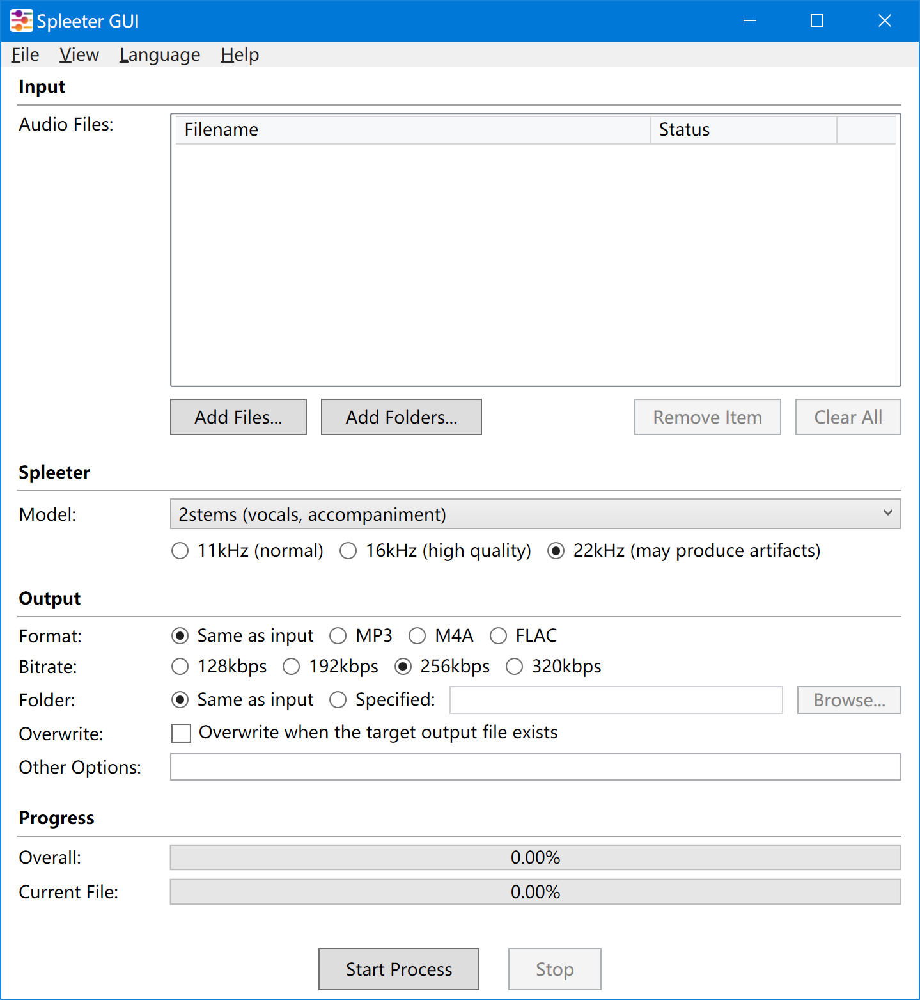
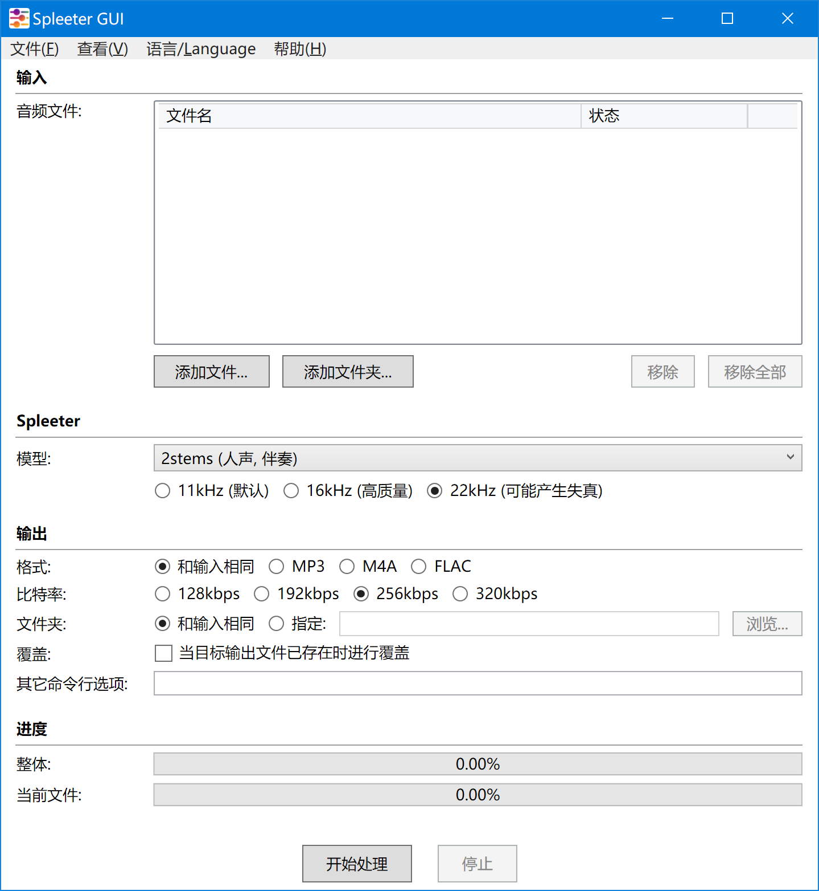

# README

 

## 1. Introduction ([中文](#1-简介))

Spleeter GUI is a graphical front-end program for [SpleeterMsvcExe](https://github.com/wudicgi/SpleeterMsvcExe).

It is written in C# + WPF, thus can adapt to various resolutions and DPI. It supports batch processing and has a user-friendly interface.

## 2. Usage

Download [the latest version of the Spleeter GUI](https://github.com/wudicgi/SpleeterGui/releases) and extract it to any location. Then download [the corresponding version of the SpleeterMsvcExe](https://github.com/wudicgi/SpleeterMsvcExe/releases) and extract it to the same directory.

Run SpleeterGui.exe to start using it.

---

## 1. 简介

Spleeter GUI 是 [SpleeterMsvcExe](https://github.com/wudicgi/SpleeterMsvcExe) 的一个图形前端程序。

使用 C# + WPF 编写，可以适应各种分辨率和 DPI。支持批量处理，界面简单易用。

## 2. 使用方法

下载[最新版本的 Spleeter GUI 程序](https://github.com/wudicgi/SpleeterGui/releases)，解压到任意位置。再下载[对应版本的 SpleeterMsvcExe 程序](https://github.com/wudicgi/SpleeterMsvcExe/releases)，解压到同一目录。

运行 SpleeterGui.exe 即可使用。
